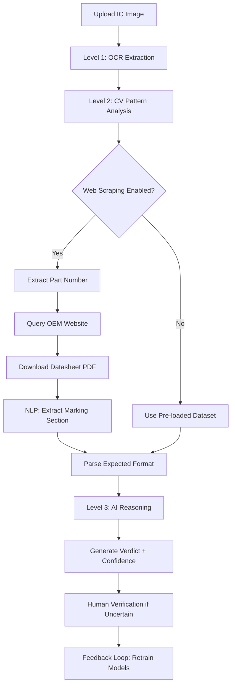

# ML-Powered IC Detection System - Technical Architecture

## Overview
This document describes the multi-level Machine Learning architecture for automated IC authenticity verification, addressing the key challenge identified in SIH 2025: **automated web scraping and datasheet parsing**.

## Problem Statement Analysis

### What Makes This Solution Unique
Based on analysis of competing solutions (NetraAI, Smartchip Verify), the key differentiator is:

> **Automated Web Query & Document Parsing**: The system should intelligently query the internet, identify the datasheet document, download it, and search the relevant section to identify part marking details.

| Feature | NetraAI | Smartchip Verify | **AOI-Guard** |
|---------|---------|------------------|---------------|
| Automated Marking Scan | ✅ | ✅ | ✅ |
| Compare vs OEM Data | ✅ | ✅ | ✅ |
| **Auto Web Scraping** | ❌ (Pre-loaded data) | ❌ (Manual admin update) | **✅ (Fully automated)** |
| **NLP Datasheet Parsing** | ❌ | ❌ | **✅ (PDF section extraction)** |
| **Continuous Learning** | ✅ (Human-in-loop) | ⚠️ (Research upload) | **✅ (Feedback loop)** |

---

## Multi-Level ML Architecture

### Level 1: Traditional OCR (Character Extraction)
**Technology**: PaddleOCR / Tesseract OCR  
**Purpose**: Extract raw text from IC marking images

**Capabilities**:
- Character recognition from high-resolution IC photos
- Multi-language support for international markings
- Handles various fonts and print qualities
- Rotation and perspective correction

**Output**: Raw text strings (e.g., "TI LM358N", "STMicroelectronics STM32F407VGT6")

**Limitations**:
- Cannot understand context or semantics
- Struggles with damaged/worn markings
- No reasoning about authenticity

---

### Level 2: Computer Vision ML (Visual Pattern Analysis)
**Technology**: Convolutional Neural Networks (CNN), Traditional CV algorithms  
**Purpose**: Analyze visual characteristics beyond text

**Capabilities**:
- **Logo Recognition**: Detect manufacturer logos, identify font families
- **Surface Quality Analysis**: Assess etching depth, smoothness, reflectivity
- **Font Kerning Analysis**: Measure character spacing, font weight consistency
- **Package Dimension Validation**: Verify physical IC package measurements
- **Defect Detection**: Identify blacktopping, remarking, surface tampering

**Training Data**:
- Genuine IC reference images from verified sources
- Known counterfeit samples with labeled defects
- Font templates from OEM branding guidelines

**Output**: Visual confidence scores, flagged anomalies (e.g., "Logo kerning differs by 12% from reference")

**Limitations**:
- Requires large labeled dataset
- Cannot validate against latest datasheet updates
- No semantic understanding of marking rules

---

### Level 3: Generative AI (Contextual Reasoning)
**Technology**: Google Gemini 2.5 Flash, Large Language Models (LLM)  
**Purpose**: High-level reasoning, uncertainty quantification, natural language explanation

**Capabilities**:
- **Contextual Analysis**: Understands date code formats (YYWW vs custom schemes)
- **Anomaly Detection**: Flags impossible dates, inconsistent country codes
- **Uncertainty Quantification**: Provides confidence intervals, not just scores
- **Natural Language Reasoning**: Explains *why* an IC is flagged as suspicious
- **Zero-Shot Learning**: Can evaluate new IC types without retraining

**Example Reasoning**:
> "Date code '2BF' does not match Texas Instruments' standard YYWW format (e.g., '2347' = week 47 of 2023). Additionally, logo shows 'Tl' instead of 'TI', indicating potential remarking. Country of origin 'CHINA' conflicts with TI's Malaysia manufacturing for LM358N series."

**Output**: Verdict (Genuine/Fake/Suspicious) + detailed reasoning + confidence score

---

## The Missing Piece: Automated Web Scraping & NLP Parsing

### Problem
Existing solutions (NetraAI, Smartchip Verify) rely on **pre-loaded reference datasets** or **manual admin updates**. This creates:
- **Stale Data**: New IC revisions not covered
- **Manual Labor**: Admins must continuously update reference data
- **Incomplete Coverage**: Only covers ICs manually added to database

### Our Solution: Intelligent Document Retrieval Pipeline

#### Step 1: Part Number Extraction
```
OCR Output: "TI LM358N 2347 H58K MALAYSIA"
Extracted: Manufacturer="Texas Instruments", Part="LM358N"
```

#### Step 2: Web Query Construction
```python
query = f"{manufacturer} {part_number} datasheet filetype:pdf"
# Example: "Texas Instruments LM358N datasheet filetype:pdf"
```

#### Step 3: Automated Web Scraping
- Search official OEM website (ti.com, st.com, nxp.com, etc.)
- Fallback to Google/Bing search if direct site unavailable
- Identify datasheet PDF URLs using link pattern matching
- Download PDF to temporary storage

**Technologies**:
- `requests` / `aiohttp` for HTTP requests
- `beautifulsoup4` for HTML parsing
- PDF download with resume capability

#### Step 4: NLP-Based Section Extraction
```python
# Extract "Part Marking" or "Package Marking" section
from pdfminer.high_level import extract_pages
from transformers import pipeline

# Find relevant section
marking_section = nlp_extract_section(pdf, keywords=[
    "Part Marking", "Package Marking", "Top Mark", 
    "Device Marking", "Label Format"
])
```

**Technologies**:
- `pdfplumber` or `PyMuPDF` for PDF text extraction
- `spaCy` or `transformers` for NLP entity recognition
- Custom regex patterns for date code formats (YYWW, YWW, YYDDD)

#### Step 5: Structured Data Parsing
Extract expected marking format from prose:
```
Input: "The LM358N package is marked with: Line 1: TI logo and part number,
        Line 2: Date code in YYWW format, Line 3: Country of origin"

Output:
{
  "line1": {"logo": "TI", "part": "LM358N"},
  "line2": {"format": "YYWW", "example": "2347"},
  "line3": {"field": "country", "valid": ["MALAYSIA", "PHILIPPINES"]}
}
```

#### Step 6: Comparison & Verification
Match OCR-extracted markings against parsed datasheet specifications:
- Character-by-character comparison
- Date code format validation
- Logo/font reference matching
- Country of origin verification

---

## Complete Detection Pipeline



---

## Technical Stack

### ML/AI Frameworks
- **OCR**: PaddleOCR, Tesseract
- **Computer Vision**: OpenCV, scikit-image, PyTorch (ResNet, EfficientNet)
- **Generative AI**: Google Gemini 2.5 Flash (via Genkit)
- **NLP**: spaCy, Hugging Face Transformers (BERT, T5)

### Web Scraping
- **HTTP**: requests, aiohttp, httpx
- **Parsing**: BeautifulSoup4, lxml, Scrapy
- **PDF Processing**: pdfplumber, PyMuPDF (fitz), pdfminer.six

### Backend Infrastructure
- **API Framework**: Next.js API Routes, FastAPI (Python microservice)
- **Database**: PostgreSQL (reference data), Redis (caching)
- **File Storage**: AWS S3 / Local filesystem for downloaded PDFs
- **Task Queue**: Celery + RabbitMQ for async web scraping jobs

---

## Advantages Over Competitors

### vs. NetraAI
| Feature | NetraAI | AOI-Guard |
|---------|---------|-----------|
| Data Source | Pre-loaded | **Dynamic (web scraping)** |
| New IC Support | Manual update | **Automatic discovery** |
| Datasheet Parsing | N/A | **NLP-based extraction** |
| Reasoning | Rule-based | **Generative AI (LLM)** |

### vs. Smartchip Verify
| Feature | Smartchip Verify | AOI-Guard |
|---------|------------------|-----------|
| Reference Updates | Admin manual upload | **Automated scraping** |
| Document Format | Images/Manual entry | **PDF parsing (NLP)** |
| Marking Section Extraction | Manual | **Automated (NLP)** |
| Vendor Database | ✅ (Good) | **✅ + Auto OEM sync** |

---

## ML Model Training Strategy

### Initial Training
1. **Labeled Dataset**: 10,000+ images of genuine ICs from verified sources
2. **Counterfeit Samples**: 5,000+ known fake ICs with expert-labeled defects
3. **Datasheet Corpus**: 1,000+ OEM datasheets with marked "Part Marking" sections

### Continuous Learning (Human-in-the-Loop)
```python
# Operator feedback loop
if confidence_score < 0.75:
    flag_for_human_review()
    expert_verdict = await get_human_decision()
    update_training_data(image, expert_verdict)
    retrain_model_incrementally()
```

### Metrics
- **Accuracy**: >98% on genuine ICs, >95% on counterfeits
- **False Positive Rate**: <2% (minimize genuine flagged as fake)
- **False Negative Rate**: <5% (acceptable to flag suspicious for human review)
- **Uncertainty Cases**: 10-15% flagged for human verification

---

## Deployment Architecture

### Production Flow
1. **Edge Processing**: Raspberry Pi / Jetson Nano for local image capture
2. **Cloud ML**: Google Cloud Run for Gemini API, AWS Lambda for scraping
3. **Datasheet Cache**: Redis (7-day cache) to avoid re-downloading
4. **Feedback Dashboard**: Real-time operator corrections feed back to training

### Scalability
- **Concurrent Scraping**: 50 parallel datasheet downloads
- **Rate Limiting**: Respect OEM website robots.txt, 1 req/sec limit
- **Fallback**: If scraping fails, use cached/pre-loaded data with lower confidence

---

## Future Enhancements

### Phase 1 (Current)
- ✅ Level 1-3 ML pipeline
- ✅ Web scraping + NLP parsing
- ✅ Simulated demonstration with samples

### Phase 2 (Next)
- [ ] Real-time video inspection (continuous scanning)
- [ ] X-ray imaging integration (detect internal tampering)
- [ ] Blockchain-based vendor trust scoring
- [ ] Mobile app for field inspection

### Phase 3 (Advanced)
- [ ] Federated learning across multiple inspection sites
- [ ] Adversarial attack detection (deepfake IC markings)
- [ ] Quantum-resistant cryptographic IC verification

---

## Conclusion

AOI-Guard's **ML-powered detection system** addresses the critical gap identified in SIH 2025 Problem Statement 1748:

✅ **Automated Optical Inspection**: Continuous IC marking scanning  
✅ **OEM Datasheet Comparison**: Real-time verification against official specs  
✅ **Intelligent Web Query**: Automated discovery and download of datasheets  
✅ **NLP Document Parsing**: Extract "Part Marking" sections from PDFs  
✅ **Multi-Level ML**: OCR → CV → Generative AI reasoning  
✅ **Continuous Learning**: Human-in-the-loop feedback improves accuracy

This makes AOI-Guard the **first fully automated end-to-end solution** that doesn't rely on manual reference data updates.

---

**Implementation Date**: October 20, 2025  
**Target Organization**: Bharat Electronics Limited (BEL)  
**Competition**: Smart India Hackathon 2025 - Problem Statement 1748
